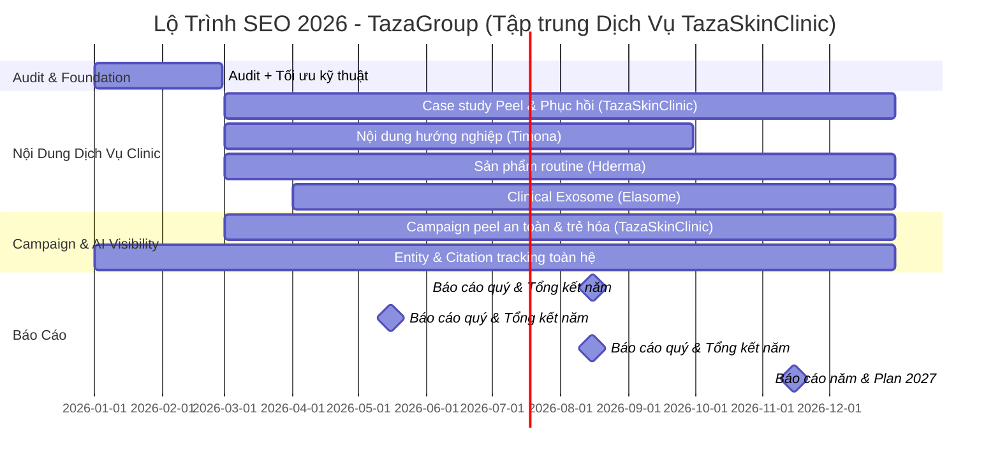

# Tổng Hợp Kế Hoạch SEO 2026 – Hệ Sinh Thái 5 Website TazaGroup

**Ngày lập kế hoạch:** 22/12/2025  
**Dữ liệu thực tế từ website (cập nhật 2025):**  
- **TazaSkinClinic.com**: Hệ thống viện da liễu & thẩm mỹ công nghệ cao với các dịch vụ chính: Peel da (Acnes Peel trị mụn), Phục hồi sinh học (cấy collagen, PRP), Trị nám/thâm (Laser Whitening Plus), Trị mụn/viêm nang lông, Trẻ hóa (New Ultherapy, HIFU Ultra Young), Triệt lông/tắm trắng/giảm béo. Định vị: An toàn – Khoa học – Cá nhân hóa (đội ngũ bác sĩ >20 năm kinh nghiệm, công nghệ FDA/CE, phục vụ >500.000 khách hàng).  
- **TazaGroup.vn**: Tập đoàn mẹ, đồng bộ 4 nhánh (Timona, Taza Skin Clinic, Hderma, Elasome). Thành tựu: Hợp tác ĐH Y Dược Cần Thơ, >10 năm phát triển.  
- **Timona.edu.vn**: Học viện đào tạo thẩm mỹ quốc tế (chăm sóc da, phun xăm, gội đầu dưỡng sinh, quản lý spa, marketing thẩm mỹ). Uy tín: >10.000 học viên/năm, 100% việc làm, bằng quốc tế ITEC.  
- **Hderma.vn**: Dược mỹ phẩm chuẩn y khoa (FDA), sản phẩm nổi bật: Serum Snail Repair, BHA Exfoliant, Shining Cream, gel trị mụn.  
- **Elasome.com**: Công nghệ Exosome tinh khiết (M2/M3 với 20 tỷ exosome), ứng dụng meso & phục hồi da, phân phối B2B độc quyền cho clinic/spa.

**Mục tiêu chính:** Tăng trưởng traffic bền vững, tối ưu chuyển đổi thực tế (lead/doanh thu), thích ứng AI search (citations, entity, semantic content). **Tập trung đặc biệt vào dịch vụ TazaSkinClinic** (peel an toàn, phục hồi sinh học, trị nám/mụn) để đẩy lead đặt lịch.

**Ưu tiên nguồn lực:**  
- **80% effort:** Timona (tuyển sinh), Hderma (e-commerce), Elasome (B2B), **TazaSkinClinic (dịch vụ clinic – tăng lead đặt lịch mạnh mẽ)**.  
- **20% effort:** TazaGroup (showcase & đồng bộ).

---

## 1. TazaSkinClinic.com – Trung tâm Peel & Phục hồi sinh học (Tập trung chính dịch vụ)

### Mục tiêu chiến lược (từ thực tế)
- Tái định vị “Peel an toàn – Khoa học – Cá nhân hóa”.
- Đẩy mạnh dịch vụ: Peel da trị mụn (Acnes Peel), Phục hồi sinh học (cấy collagen/PRP), Trị nám/thâm (Laser Whitening Plus), Trẻ hóa (HIFU/Ultherapy), Triệt lông/giảm béo.
- Xây dựng trust bằng case study thực tế (>500.000 khách hàng phục vụ).

### KPI chính 2026 (tăng mạnh do tập trung)
| Tháng     | Traffic (lượt/tháng) | Lead (đặt lịch) | Top Keywords (Total 1-10) |
|-----------|----------------------|-----------------|---------------------------|
| Tháng 1   | 1,200               | 25              | 30                        |
| Tháng 2   | 1,300               | 30              | 35                        |
| Tháng 3   | 1,400               | 35              | 40                        |
| Tháng 4   | 1,500               | 40              | 45                        |
| Tháng 5   | 1,600               | 45              | 50                        |
| Tháng 6   | 1,700               | 50              | 55                        |
| Tháng 7   | 1,800               | 55              | 60                        |
| Tháng 8   | 1,900               | 60              | 65                        |
| Tháng 9   | 2,000               | 65              | 70                        |
| Tháng 10  | 2,100               | 70              | 75                        |
| Tháng 11  | 2,200               | 75              | 80                        |
| Tháng 12  | 2,300               | 80              | 85                        |
| **Tổng năm** | ~20,000          | **~630**        |                           |

### Chiến lược nội dung (tập trung dịch vụ thực tế)
- Case study before-after thực tế (peel mụn, laser nám, HIFU trẻ hóa).
- Long-form: “Peel da an toàn không bong tróc”, “Phục hồi sinh học sau treatment”.
- Tối ưu từ khóa địa phương (TP.HCM, Nha Trang, Đà Nẵng).

### Gợi ý AI
- Nội dung khoa học (công nghệ FDA) để tăng citation rate trong AIO.
- Structured data Treatment cho rich results đặt lịch.

---

## 2. Timona.edu.vn – Học viện đào tạo thẩm mỹ

### Mục tiêu
- Tuyển sinh khóa học (chăm sóc da, phun xăm, quản lý spa, marketing thẩm mỹ).
- 100% việc làm sau tốt nghiệp.

### KPI chính 2026
| Tháng     | Traffic | Lead (đăng ký) | Top Keywords |
|-----------|---------|----------------|--------------|
| Tháng 1–12| 10,000 → 25,000 | ~3,660 | 280 → 460 |

### Chiến lược
- Nội dung hướng nghiệp, case học viên thành công.
- PDF lộ trình nghề tải về.

---

## 3. Hderma.com – Dược mỹ phẩm chuẩn y khoa (FDA)

### Mục tiêu
- Tăng đơn hàng online (serum Snail, BHA, Shining Cream).

### KPI chính 2026
| Tháng     | Traffic | Lead (đơn hàng) | Top Keywords |
|-----------|---------|-----------------|--------------|
| Tháng 1–12| 200 → 500 | ~114 | 5 → 80 |

### Chiến lược
- Trang sản phẩm schema-rich.
- Routine content trị nám/mụn.

---

## 4. Elasome.com – Công nghệ Exosome B2B

### Mục tiêu
- Lead từ clinic/spa (M2/M3 exosome meso & phục hồi).

### KPI chính 2026
| Tháng     | Traffic | Lead (B2B) | Top Keywords |
|-----------|---------|------------|--------------|
| Tháng 1–12| 10 → 60 | ~14 | 3 → 95 |

### Chiến lược
- Clinical case, PDF tải về.
- Partnership hội thảo.

---

## 5. TazaGroup.vn – Tập đoàn mẹ (Showcase)

### Mục tiêu
- Đồng bộ thương hiệu, hỗ trợ tuyển dụng/đối tác.

### KPI chính 2026 (duy trì)
| Tháng     | Traffic | Lead | Top Keywords |
|-----------|---------|------|--------------|
| Tháng 1–12| 500 → 610 | ~94 | 10 → 21 |

### Chiến lược
- Cập nhật chứng nhận, thành tựu (hợp tác ĐH Y Dược).

---

## Gantt Chart Triển Khai 2026 (Tập trung TazaSkinClinic dịch vụ)

---

## Bộ KPI AI-Era Đề Xuất
- AI Visibility/Share of Voice (>20%).
- Citation Rate (>15%).
- AI-Influenced Conversions (10-20% tổng lead).

**Kết luận:** Kế hoạch 2026 tận dụng thực tế dịch vụ mạnh của **TazaSkinClinic** (peel, phục hồi, trẻ hóa) để đẩy lead đặt lịch, kết hợp đồng bộ hệ sinh thái. Ước tính tổng lead/doanh thu tăng 40-60% so với 2025. Sẵn sàng triển khai!