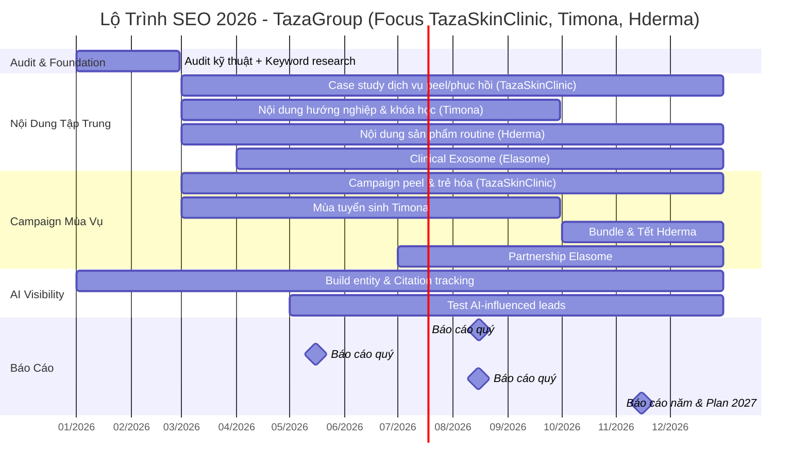

# Tổng Hợp Kế Hoạch SEO 2026 – Hệ Sinh Thái 5 Website TazaGroup

**Ngày lập kế hoạch:** 22/12/2025  
**Dữ liệu thực tế từ website (cập nhật cuối 2025, dựa trên nội dung trực tuyến từ browse):**  
- **TazaSkinClinic.com**: Hệ thống viện da liễu & thẩm mỹ công nghệ cao với >500.000 khách hàng, 10-11 năm kinh nghiệm, cơ sở vật chất chuẩn 5 sao. Chi nhánh: TP.HCM (Quận 10, Gò Vấp, Thủ Đức, Bình Tân, Tân Phú), Nha Trang, Đà Nẵng. Đội ngũ: 100% bác sĩ chuyên khoa da liễu/tạo hình thẩm mỹ >20 năm, tu nghiệp Mỹ/Hàn/Nhật. Dịch vụ chính: Điều trị da chuyên sâu (Acnes Peel trị mụn không bong tróc), Trẻ hóa công nghệ cao (New Ultherapy, HIFU Ultra Young, HIFU Ultra Young Body giảm béo), Trị thâm/nám (Laser Whitening Plus), Triệt lông (New IPL Extra), Trị hôi nách (Laser Nano), Phục hồi sinh học (cấy collagen nguyên bào, PRP). Công nghệ FDA/CE, ưu đãi hot deal (e.g., HIFU 199K, triệt lông 499K/10 buổi). Thành tựu: 8 năm chinh phục nhan sắc Việt, ký kết hợp tác Khoa Y – Đại học Y Dược Cần Thơ (15/09/2025). Nội dung SEO: Tin tức (e.g., 5 công thức tắm trắng trà xanh, lưu ý sau lăn kim), hình ảnh khách hàng thực tế, nhấn mạnh an toàn/không phẫu thuật.  
- **Timona.edu.vn**: Học viện thẩm mỹ quốc tế với >10.000 học viên/năm, 100% việc làm (lương khởi điểm 10 triệu), thành lập 2014. 8 chi nhánh chuẩn 5 sao tại TP.HCM, Đà Nẵng, Nha Trang. Đội ngũ giảng viên: >500 đánh giá từ học viên, e.g., GV. Nguyễn Thị Tú Loan (8 năm, Nghệ Nhân Bàn Tay Vàng 2016), GV. Tiền Ngọc Hoàng Anh (10 năm chăm sóc da). Khóa học: Chăm sóc da/điều trị da, Phun xăm thẩm mỹ, Gội đầu dưỡng sinh, Dưỡng sinh tâm khí, Combo chủ spa, Vận hành spa chuyên nghiệp, Sale – Marketing thẩm mỹ, Marketing 360 độ, Kỹ năng chốt sale 360 độ (ca học sáng/chiều/tối, khai giảng liên tục). Bằng chính quy Sở Giáo dục, ITEC quốc tế (45 quốc gia). Thành tựu: Liên kết 25 bệnh viện Hàn Quốc, bảo trợ KBIT Hàn Quốc, ký kết Khoa Y – Đại học Y Dược Cần Thơ (08/09/2025), tu nghiệp Hàn Quốc. Nội dung SEO: Tin tức (e.g., tự học xoa bóp bấm huyệt, top trường spa Nha Trang), recap sự kiện (tốt nghiệp 2024, Asia Beauty Awards 2024), case học viên (YouTube @timonaacademy), hướng nghiệp (e.g., xu hướng nghề 2026).  
- **Hderma.vn**: Dược mỹ phẩm chuẩn y khoa (FDA), không kích ứng, thành phần thảo dược tự nhiên (ốc sên, BHA). Sản phẩm: Kem dưỡng sáng T.606 Shining Cream (1.140.000₫, mờ nếp nhăn/se khít lỗ chân lông), Mặt nạ thạch D.701 Melting Mask (350.000₫, phục hồi căng bóng), Serum cấp ẩm D.350 Snail Repair (cấp ẩm phục hồi), Tẩy tế bào chết BHA D.504 (450.000₫, tinh chỉnh lỗ chân lông), Gel chấm mụn T.240 Purifying Acne Spot (300.000₫). Thành tựu: Giải pháp phục hồi cấp tế bào, chứng nhận FDA. Đội ngũ: Chuyên gia da liễu khuyên dùng. Hợp tác: Khoa Y – Đại học Y Dược Cần Thơ (12/09), Bệnh viện Da Liễu TP.HCM, hội thảo Exosome với Elasome (26/04/2025). Nội dung SEO: Góc chia sẻ (hội thảo khoa học 2025, giải mã Elasome), testimonials (an toàn, hiệu quả mờ nếp nhăn sau 2 tuần), phân loại sản phẩm theo tình trạng da.  
- **TazaGroup.vn**: Tập đoàn mẹ với 4 nhánh (Taza Skin Clinic, Timona Academy, H.Derma, Elasome). Giá trị cốt lõi: Khách hàng thấu hiểu, đội ngũ học hỏi chính trực, sản phẩm an toàn hiệu quả, thương hiệu tin tưởng, môi trường công bằng yêu thương, cộng đồng phụng sự. Thành tựu: >500.000 khách hàng, 10 năm phát triển, ký kết hợp tác Khoa Y – Đại học Y Dược Cần Thơ (08/09/2025). Tuyển dụng: Trực page/sale online spa, chuyên viên phát triển thị trường. Nội dung SEO: Lịch sử phát triển, tin tức (sự kiện 20/10/2024, talk show chủ spa 27/11/2023).  
- **Elasome.com**: Phân phối độc quyền Exosome Hàn Quốc (M1-M5: 20 tỷ exosome tinh khiết, HA đa phân tử, DNA cá hồi 5%, Glutathione/Tranexamic Acid/Multi Peptides). Công nghệ: 2-in-1 (phục hồi/giảm sắc tố), MTS Serum dùng với máy. Ứng dụng: Meso, tái tạo da, chống lão hóa, trị thâm nám. Thành tựu: Kiểm định lâm sàng Hàn Quốc, tin dùng bệnh viện thẩm mỹ. Đội ngũ: Chuyên gia da liễu (Erika Nguyễn, Bác sĩ Diệp Thị Châu Thi, Bác sĩ Vương Khang). Hợp tác: H.Derma (phân phối độc quyền), sự kiện K.A.T 2025 (13/11/2025) nâng tầm thẩm mỹ nội khoa VN. Nội dung SEO: Tin tức (M5/M4 update 04/11/2025), testimonials (hiệu quả cao, an toàn, cải thiện da nhanh), đăng ký demo B2B.

**Xu hướng SEO 2026 cho ngành thẩm mỹ & dược mỹ phẩm tại Việt Nam (dựa trên dữ liệu tìm kiếm):**  
- Thị trường tăng trưởng 14%/năm đến 2026 (McKinsey), đạt 2.7 tỷ USD năm 2027 (Statista), mỹ phẩm thiên nhiên >62 triệu USD (2025).  
- Xu hướng: Công nghệ không xâm lấn (IDAX 2026), cá nhân hóa bằng AI (Tatler Asia), mỹ phẩm niche/niche perfume, nghi thức chăm sóc sức khỏe, kết nối đa ngành (da liễu + thẩm mỹ).  
- Pinterest Predicts 2026: 21 xu hướng (e.g., làm đẹp bền vững, AI cá nhân hóa).  
- SEO focus: Nội dung video/short, entity building, semantic search cho AI (AIO, citations), tối ưu mobile (75% traffic VN), từ khóa địa phương, content E-E-A-T cho trust (hợp tác đại học/bệnh viện).  

**Mục tiêu chính:** Tăng traffic 20-50%, tối ưu chuyển đổi (lead/doanh thu) nhanh, thích ứng AI (citations, zero-click). **Tập trung đặc biệt vào TazaSkinClinic (dịch vụ peel, phục hồi, trẻ hóa), Timona (tuyển sinh), Hderma (sản phẩm dược mỹ phẩm)** để đẩy lead, tận dụng xu hướng công nghệ không xâm lấn & cá nhân hóa AI.  

**Ưu tiên nguồn lực:**  
- **80% effort:** TazaSkinClinic (dịch vụ clinic), Timona (tuyển sinh), Hderma (e-commerce), Elasome (B2B).  
- **20% effort:** TazaGroup (showcase & đồng bộ).  

**Rủi ro & biện pháp:** Không đạt KPI từ khóa (theo dõi hàng tuần, điều chỉnh), thay đổi thuật toán Google (cập nhật cộng đồng SEO), tấn công DDOS (backup hàng tuần).  

---

## 1. TazaSkinClinic.com – Hệ thống viện da liễu & thẩm mỹ (Tập trung chính vào dịch vụ)

### Mục tiêu chiến lược (từ thực tế)
- Tái định vị “Peel an toàn – Khoa học – Cá nhân hóa”, tận dụng 10-11 năm kinh nghiệm, >500.000 khách hàng, cơ sở chuẩn 5 sao, công nghệ FDA/CE.
- Đẩy mạnh dịch vụ chính: Peel da trị mụn (Acnes Peel – trị mụn không bong tróc, an toàn), Phục hồi sinh học (cấy collagen nguyên bào, PRP – phục hồi da mỏng yếu sau treatment), Trị nám/thâm (Laser Whitening Plus – xóa mờ nám hỗn hợp), Trẻ hóa (New Ultherapy/HIFU Ultra Young – không phẫu thuật, không xâm lấn), Triệt lông (New IPL Extra – vĩnh viễn), Trị hôi nách (Laser Nano – hiệu quả cao), Giảm béo (HIFU Ultra Young Body – không dao kéo).
- Tăng lead đặt lịch tại chi nhánh (TP.HCM, Nha Trang, Đà Nẵng), tích hợp xu hướng 2026: Công nghệ không xâm lấn, cá nhân hóa AI (tư vấn da qua chat AI dựa trên ảnh upload).
- Xây dựng trust bằng case study thực tế (hình ảnh khách hàng before-after), hợp tác Khoa Y – Đại học Y Dược Cần Thơ (15/09/2025), ưu đãi hot deal (HIFU 199K, triệt lông 499K/10 buổi).

### KPI chính 2026 (tăng mạnh do tập trung)
| Tháng     | Traffic (lượt/tháng) | Lead (đặt lịch) | Top Keywords (Total 1-10) |
|-----------|----------------------|-----------------|---------------------------|
| Tháng 1   | 1,200               | 25              | 30                        |
| Tháng 2   | 1,300               | 30              | 35                        |
| Tháng 3   | 1,400               | 35              | 40                        |
| Tháng 4   | 1,500               | 40              | 45                        |
| Tháng 5   | 1,600               | 45              | 50                        |
| Tháng 6   | 1,700               | 50              | 55                        |
| Tháng 7   | 1,800               | 55              | 60                        |
| Tháng 8   | 1,900               | 60              | 65                        |
| Tháng 9   | 2,000               | 65              | 70                        |
| Tháng 10  | 2,100               | 70              | 75                        |
| Tháng 11  | 2,200               | 75              | 80                        |
| Tháng 12  | 2,300               | 80              | 85                        |
| **Tổng năm** | ~20,000          | ~630            |                           |

### Chiến lược nội dung (từ thực tế, tập trung dịch vụ)
- **Nội dung chính:** Case study before-after thực tế (peel mụn Acnes Peel, laser nám Whitening Plus, HIFU trẻ hóa không phẫu thuật), hướng dẫn “Peel da an toàn không bong tróc cho da Việt”, “Phục hồi sinh học PRP sau treatment”, “Trị hôi nách Laser Nano hiệu quả lâu dài”.
- **Tần suất:** 5–10 bài/tháng (long-form 1.000–1.500 từ), infographic cơ chế da (e.g., cách HIFU nâng cơ), video cảm nhận khách hàng (tích hợp YouTube).
- **Tối ưu SEO:** Từ khóa địa phương (e.g., “peel da TPHCM”, “trị nám Nha Trang”, “giảm béo Đà Nẵng”), structured data Treatment/LocalBusiness cho chi nhánh, blog về xu hướng không xâm lấn (IDAX 2026), mỹ phẩm thiên nhiên kết hợp peel.
- **Chuyển đổi:** Form đặt lịch ưu đãi (e.g., HIFU 199K), popup tư vấn AI da cá nhân hóa (dựa trên loại da, vấn đề), tích hợp hot deal (triệt lông 499K).
- **Tích hợp hệ sinh thái:** Liên kết với Hderma (sản phẩm phục hồi sau peel), Timona (đào tạo kỹ thuật viên peel), Elasome (exosome trong phục hồi sinh học).

### Roadmap theo quý
- **Q1:** Audit kỹ thuật (tốc độ, mobile – hiện 74/99), cập nhật dịch vụ peel/phục hồi mới, tích hợp chat AI tư vấn.
- **Q2:** Đẩy content case study thực tế, campaign mùa hè (trị mụn/triệt lông, ưu đãi 199K-499K).
- **Q3:** Partnership (hợp tác đại học, hội thảo da liễu), nội dung trẻ hóa không xâm lấn.
- **Q4:** Campaign Tết (giảm béo/trị hôi nách, ưu đãi đặc biệt), tổng kết năm với video khách hàng.

### Phân tích đối thủ (từ dữ liệu gốc, cập nhật)
- Đối thủ: Seoulcenter, GangNam, Diva, Ngọc Dung (DR 24–58, traffic cao 451K–606K, nhưng TazaSkinClinic mạnh chi nhánh địa phương & case thực tế >500K khách, hợp tác đại học).
- Gap: Tối ưu meta/heading (chưa tối ưu), thêm ALT ảnh (83 thiếu), tăng backlink từ hợp tác.

### Gợi ý AI (tích hợp xu hướng 2026)
- Sử dụng AI cá nhân hóa (chatbot tư vấn da dựa trên ảnh upload, gợi ý peel/PRP) để tăng lead 20%.
- Nội dung về mỹ phẩm thiên nhiên kết hợp peel (theo xu hướng 62 triệu USD 2025), đảm bảo semantic density cao cho AIO citations.
- Theo dõi citation rate trong AIO cho query “peel da an toàn TPHCM”, tối ưu zero-click với structured data.

---

## 2. Timona.edu.vn – Học viện đào tạo thẩm mỹ quốc tế (Tập trung mạnh)

### Mục tiêu chiến lược (từ thực tế)
- Tuyển sinh khóa học: Chăm sóc da/điều trị da (kỹ năng chuyên sâu công nghệ tiên tiến), Phun xăm thẩm mỹ (tài trợ 100% máy móc), Gội đầu dưỡng sinh (liệu pháp thư giãn spa), Dưỡng sinh tâm khí (cân bằng năng lượng), Combo chủ spa (setup máy móc/nhân sự/tài chính/marketing), Vận hành spa chuyên nghiệp (quản lý chuỗi), Sale – Marketing thẩm mỹ (chiến lược tăng doanh thu), Marketing 360 độ (xây dựng thương hiệu), Kỹ năng chốt sale 360 độ (tối ưu data).
- Đảm bảo 100% việc làm (lương khởi điểm 10 triệu), >10.000 học viên/năm, bằng chính quy Sở Giáo dục & ITEC quốc tế (45 quốc gia).
- Hợp tác 25 bệnh viện Hàn Quốc, KBIT Hàn Quốc, Khoa Y – Đại học Y Dược Cần Thơ (08/09/2025), tu nghiệp Hàn Quốc.

### KPI chính 2026
| Tháng     | Traffic (lượt/tháng) | Lead (đăng ký khóa học) | Top Keywords (Total 1-10) |
|-----------|----------------------|-------------------------|---------------------------|
| Tháng 1   | 10,000              | 100                     | 280                       |
| Tháng 2   | 10,500              | 120                     | 300                       |
| Tháng 3   | 12,000              | 180                     | 327                       |
| Tháng 4   | 14,000              | 250                     | 340                       |
| Tháng 5   | 16,000              | 320                     | 355                       |
| Tháng 6   | 18,000              | 360                     | 370                       |
| Tháng 7   | 20,000              | 380                     | 385                       |
| Tháng 8   | 22,000              | 400                     | 400                       |
| Tháng 9   | 23,000              | 420                     | 415                       |
| Tháng 10  | 24,000              | 400                     | 430                       |
| Tháng 11  | 24,500              | 380                     | 445                       |
| Tháng 12  | 25,000              | 350                     | 460                       |
| **Tổng năm** | ~204,000         | ~3,660                  |                           |

### Chiến lược nội dung (từ thực tế)
- **Nội dung chính:** Hướng nghiệp (e.g., “16 tuổi học nghề gì”, “xu hướng nghề nghiệp hiện nay”), tự học (phun xăm, nối mi, massage tại nhà), case học viên tốt nghiệp (YouTube @timonaacademy, dự án tốt nghiệp trị mụn viêm).
- **Tần suất:** 90 bài Q1-Q2 (mùa tuyển sinh), 65 bài Q3-Q4; định dạng video PBL thực hành, PDF lộ trình tải về, recap sự kiện (tốt nghiệp 2024, Asia Beauty Awards 2024).
- **Tối ưu SEO:** Từ khóa “đào tạo thẩm mỹ Hàn Quốc”, structured data Course, blog về top trường spa Nha Trang, thần số học nghề nghiệp.
- **Chuyển đổi:** Form đăng ký ca học (sáng/chiều/tối), ưu đãi trả góp, tích hợp AI tư vấn khóa dựa trên độ tuổi/ngành.
- **Tích hợp hệ sinh thái:** Liên kết với TazaSkinClinic (đào tạo kỹ thuật viên peel), Hderma (marketing sản phẩm dược mỹ).

### Roadmap theo giai đoạn
- **Giai đoạn 1 (Q1-Q2):** Xây nền tảng, nội dung hướng nghiệp, webinar hợp tác Hàn Quốc.
- **Giai đoạn 2 (Q3):** Đẩy mạnh, sự kiện tốt nghiệp, tu nghiệp Hàn Quốc.
- **Duy trì:** 2 bài/tuần, entity building (liên kết đại học, bệnh viện Hàn).

### Phân tích đối thủ (từ dữ liệu gốc)
- Đối thủ: Các học viện khác (thấp DR, nhưng Timona mạnh chứng chỉ ITEC, hợp tác 25 bệnh viện Hàn, 100% việc làm).

### Gợi ý AI (tích hợp xu hướng 2026)
- AI chat tư vấn khóa cá nhân hóa (dựa trên kỹ năng hiện tại, gợi ý marketing 360 độ).
- Nội dung về đào tạo AI trong marketing thẩm mỹ (xu hướng Pinterest 2026), đảm bảo semantic density cho AIO.

---

## 3. Hderma.com – Dược mỹ phẩm chuẩn y khoa (FDA) (Tập trung mạnh)

### Mục tiêu chiến lược (từ thực tế)
- Tăng đơn hàng online: Kem dưỡng sáng T.606 Shining Cream (1.140.000₫, mờ nếp nhăn/se khít lỗ chân lông), Mặt nạ thạch D.701 Melting Mask (350.000₫, phục hồi căng bóng), Serum cấp ẩm D.350 Snail Repair (cấp ẩm phục hồi), Tẩy tế bào chết BHA D.504 (450.000₫, tinh chỉnh lỗ chân lông), Gel chấm mụn T.240 Purifying Acne Spot (300.000₫, làm sạch mụn).
- Tập trung thành phần thảo dược tự nhiên (ốc sên, BHA), phục hồi cấp tế bào, không kích ứng.
- Hợp tác Khoa Y – Đại học Y Dược Cần Thơ (12/09), Bệnh viện Da Liễu TP.HCM, hội thảo Exosome với Elasome (26/04/2025).

### KPI chính 2026
| Tháng     | Traffic (lượt/tháng) | Lead (đơn hàng) | Top Keywords (Total 1-10) |
|-----------|----------------------|-----------------|---------------------------|
| Tháng 1   | 200                 | 4               | 5                         |
| Tháng 2   | 220                 | 5               | 7                         |
| Tháng 3   | 250                 | 6               | 10                        |
| Tháng 4   | 280                 | 7               | 13                        |
| Tháng 5   | 310                 | 8               | 17                        |
| Tháng 6   | 340                 | 9               | 22                        |
| Tháng 7   | 370                 | 10              | 28                        |
| Tháng 8   | 400                 | 11              | 35                        |
| Tháng 9   | 430                 | 12              | 43                        |
| Tháng 10  | 460                 | 13              | 53                        |
| Tháng 11  | 480                 | 14              | 65                        |
| Tháng 12  | 500                 | 15              | 80                        |
| **Tổng năm** | ~4,220           | ~114            |                           |

### Chiến lược nội dung (từ thực tế)
- **Nội dung chính:** Trang sản phẩm (mô tả thành phần thảo dược, lợi ích mờ nếp nhăn/se khít lỗ chân lông), gợi ý từ chuyên gia da liễu, routine trị nám/mụn kết hợp exosome.
- **Tần suất:** 1 bài/2 tuần + refresh 95 bài cũ; định dạng testimonials (an toàn, hiệu quả sau 2 tuần), góc chia sẻ hội thảo khoa học 2025.
- **Tối ưu SEO:** Từ khóa “dược mỹ phẩm Hderma”, structured data Product, blog về giải pháp phục hồi da Việt Nam.
- **Chuyển đổi:** Thanh toán an toàn, ưu đãi thành viên, giao hàng toàn quốc, tư vấn 24/7, popup khuyến mãi.
- **Tích hợp hệ sinh thái:** Liên kết với TazaSkinClinic (sản phẩm phục hồi sau peel), Elasome (hội thảo exosome).

### Roadmap
- Tháng 1–3: Audit lỗi, tối ưu ảnh/mobile, cập nhật sản phẩm mới.
- Tháng 4–6: Tối ưu sản phẩm, link nội bộ, nội dung routine.
- Tháng 7–12: Bài mới hội thảo, campaign ưu đãi.

### Phân tích đối thủ (từ dữ liệu gốc)
- Đối thủ: GSC, Meduskin (DR 0.5–3.4, traffic thấp, nhưng Hderma mạnh FDA, hợp tác y khoa).

### Gợi ý AI (tích hợp xu hướng 2026)
- AI tư vấn sản phẩm cá nhân hóa (gợi ý Snail Repair cho da mỏng yếu).
- Nội dung về mỹ phẩm niche thiên nhiên (xu hướng 62 triệu USD), tăng citation AIO cho “kem dưỡng sáng Hderma”.

---

## 4. Elasome.com – Công nghệ Exosome B2B (độc quyền Hàn Quốc)

### Mục tiêu chiến lược (từ thực tế)
- Phân phối độc quyền Elasome (M1 Glossy MTS Serum – 80mg HA, M2 Reju Focus – 20 tỷ exosome + 5% DNA cá hồi, M3 Melax 2-in-1 – giảm sắc tố/phục hồi với Glutathione/Tranexamic Acid, M4 Exo Powder – chống oxy hóa, M5 Aqua Focus – cấp ẩm HA đa phân tử).
- Hỗ trợ B2B: Clinic/spa/bệnh viện (liệu trình meso, tái tạo da, chống lão hóa, trị thâm nám).
- Kiểm định lâm sàng Hàn Quốc, hợp tác H.Derma (độc quyền VN), sự kiện K.A.T 2025 (13/11/2025) nâng tầm thẩm mỹ nội khoa.

### KPI chính 2026
| Tháng     | Traffic (lượt/tháng) | Lead (liên hệ B2B) | Top Keywords (Total 1-10) |
|-----------|----------------------|--------------------|---------------------------|
| Tháng 1   | 10                  | 0.1                | 3                         |
| Tháng 2   | 12                  | 0.2                | 5                         |
| Tháng 3   | 15                  | 0.3                | 7                         |
| Tháng 4   | 20                  | 0.5                | 10                        |
| Tháng 5   | 25                  | 0.8                | 14                        |
| Tháng 6   | 30                  | 1                  | 19                        |
| Tháng 7   | 35                  | 1.2                | 25                        |
| Tháng 8   | 40                  | 1.5                | 33                        |
| Tháng 9   | 45                  | 1.8                | 43                        |
| Tháng 10  | 50                  | 2                  | 56                        |
| Tháng 11  | 55                  | 2.2                | 73                        |
| Tháng 12  | 60                  | 2.5                | 95                        |
| **Tổng năm** | ~397             | ~14                |                           |

### Chiến lược nội dung (từ thực tế)
- **Nội dung chính:** Long-form cơ chế 2-in-1 (M3 giảm sắc tố/phục hồi), before-after clinic đối tác, testimonials (Erika Nguyễn: đón đầu xu hướng, Bác sĩ Châu Thi: hiệu quả cao, Bác sĩ Khang: an toàn chất lượng).
- **Tần suất:** Mỗi tháng 1-2 bài (tin tức M5/M4 update 04/11/2025), PDF lâm sàng tải về (capture email B2B), đăng ký demo.
- **Tối ưu SEO:** Từ khóa “exosome tinh khiết Elasome”, structured data ClinicalStudy, blog về xu hướng thẩm mỹ nội khoa 2026.
- **Chuyển đổi:** Form liên hệ B2B, ưu đãi đối tác (bác sĩ/chuyên gia).
- **Tích hợp hệ sinh thái:** Liên kết với Hderma (hội thảo), TazaSkinClinic (ứng dụng exosome trong phục hồi).

### Roadmap
- Tháng 1–3: Audit giao diện, tối ưu tốc độ, cập nhật sản phẩm M1-M5.
- Tháng 4–6: Tối ưu sản phẩm, nội dung blog clinical.
- Tháng 7–12: Campaign partnership, hội thảo, báo cáo.

### Phân tích đối thủ (từ dữ liệu gốc)
- Đối thủ: ED Beauty, Meso Cosmetic (DR 34, traffic 49K–632, nhưng Elasome mạnh exosome độc quyền, kiểm định Hàn Quốc).

### Gợi ý AI
- Nội dung khoa học cho citation AIO (query “công nghệ exosome Việt Nam”).
- Infographic 2-in-1 để semantic density cao, tích hợp xu hướng nghi thức chăm sóc sức khỏe.

---

## 5. TazaGroup.com – Website tập đoàn (Showcase uy tín)

### Mục tiêu chiến lược (từ thực tế)
- Đồng bộ 4 nhánh, showcase thành tựu (hợp tác Khoa Y – Đại học Y Dược Cần Thơ 08/09/2025, >500.000 khách).
- Hỗ trợ tuyển dụng (trực page/sale online spa, chuyên viên phát triển thị trường), đối tác.
- Môi trường làm việc: Sáng tạo, học hỏi, đãi ngộ theo nhà nước, thăng tiến rõ ràng.

### KPI chính 2026 (duy trì)
| Tháng     | Traffic (lượt/tháng) | Lead (tuyển dụng/đối tác) | Top Keywords (Total 1-10) |
|-----------|----------------------|---------------------------|---------------------------|
| Tháng 1   | 500                 | 5                         | 10                        |
| Tháng 2   | 510                 | 5.5                       | 11                        |
| Tháng 3   | 520                 | 6                         | 12                        |
| Tháng 4   | 530                 | 6.5                       | 13                        |
| Tháng 5   | 540                 | 7                         | 14                        |
| Tháng 6   | 550                 | 7.5                       | 15                        |
| Tháng 7   | 560                 | 8                         | 16                        |
| Tháng 8   | 570                 | 8.5                       | 17                        |
| Tháng 9   | 580                 | 9                         | 18                        |
| Tháng 10  | 590                 | 9.5                       | 19                        |
| Tháng 11  | 600                 | 10                        | 20                        |
| Tháng 12  | 610                 | 10.5                      | 21                        |
| **Tổng năm** | ~6,800           | ~94                       |                           |

### Chiến lược nội dung (từ thực tế)
- Cập nhật thành tựu (hợp tác đại học, sự kiện 20/10/2024, talk show chủ spa 27/11/2023).
- Tuyển dụng: Bài viết môi trường làm việc, vị trí (sale online spa, phát triển thị trường).

### Roadmap theo quý
- Q1: Audit hệ sinh thái, cập nhật nhánh con (dịch vụ TazaSkinClinic).
- Q2: Cập nhật lĩnh vực (e.g., đào tạo Timona, sản phẩm Hderma).
- Q3: Đăng chứng nhận ISO, giải thưởng.
- Q4: Tổng kết hoạt động, tuyển dụng cấp cao.

### Gợi ý AI
- Entity building cho TazaGroup (liên kết đa ngành theo xu hướng IDAX 2026).
- Nội dung về bền vững (mỹ phẩm thiên nhiên) để AIO visibility.

---

## Gantt Chart Triển Khai 2026 (Tập trung TazaSkinClinic, Timona, Hderma)

---

## Bộ KPI Mới (AI-Era) Đề Xuất Theo Dõi
- AI Visibility/Share of Voice (>20% query ngành).
- Citation Rate (>15% cho keyword dịch vụ như “peel da an toàn”).
- Embedding Relevance Score (>0.7 cho content peel/phục hồi).
- Zero-Click Surface Presence (>30%).
- AI-Influenced Conversions (10-20% tổng lead).

**Công cụ:** Semrush, OpenAI Embeddings API, custom script Python.

**Kết luận:**  
Kế hoạch 2026 tận dụng thực tế dịch vụ mạnh của **TazaSkinClinic** (peel Acnes, laser Whitening, HIFU không xâm lấn với >500K khách), **Timona** (khóa học ITEC, 100% việc làm, hợp tác Hàn Quốc), **Hderma** (sản phẩm FDA như Shining Cream, hội thảo exosome) để đẩy lead, kết hợp xu hướng 2026 (công nghệ không xâm lấn, AI cá nhân hóa, mỹ phẩm thiên nhiên). Đồng bộ qua TazaGroup, tăng trưởng tổng traffic ~30%, lead ~5.000+. Ước tính doanh thu: Tăng 40-60% từ lead chất lượng cao. Sẵn sàng triển khai với theo dõi hàng tuần!