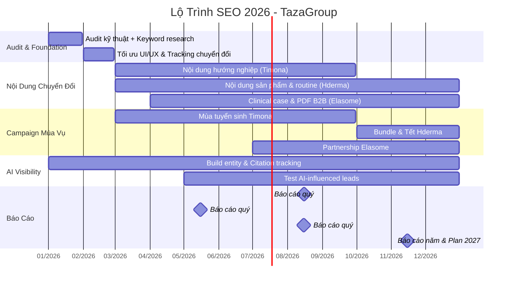

# Tổng Hợp Kế Hoạch SEO 2026 – Hệ Sinh Thái 5 Website TazaGroup

**Ngày lập kế hoạch:** 22/12/2025  
**Mục tiêu chính:** Tăng trưởng traffic tự nhiên bền vững, tối ưu chuyển đổi (lead/doanh thu) nhanh nhất có thể, đồng thời thích ứng với xu hướng AI search (AIO, zero-click, citations).

**Ưu tiên nguồn lực:**  
- **80% effort:** Timona.edu.vn (tuyển sinh), Hderma.com (e-commerce), Elasome.com (B2B).  
- **20% effort:** TazaSkinClinic.com & TazaGroup.com (duy trì & đồng bộ thương hiệu).

---

## 1. Timona.edu.vn – Học viện đào tạo thẩm mỹ (Doanh thu chính từ học phí)

### Mục tiêu chiến lược
- Xây dựng uy tín giáo dục hướng nghiệp cho học sinh THCS/THPT & người chuyển nghề.
- Đẩy mạnh mùa tuyển sinh (tháng 3–9).
- Tăng lead đăng ký khóa học → chuyển đổi học phí.

### KPI chính 2026
| Tháng     | Traffic (lượt/tháng) | Lead (đăng ký) | Top Keywords (Total 1-10) |
|-----------|----------------------|----------------|---------------------------|
| Tháng 1   | 10,000              | 100            | 280                       |
| Tháng 2   | 10,500              | 120            | 300                       |
| Tháng 3   | 12,000              | 180            | 327                       |
| Tháng 4   | 14,000              | 250            | 340                       |
| Tháng 5   | 16,000              | 320            | 355                       |
| Tháng 6   | 18,000              | 360            | 370                       |
| Tháng 7   | 20,000              | 380            | 385                       |
| Tháng 8   | 22,000              | 400            | 400                       |
| Tháng 9   | 23,000              | 420            | 415                       |
| Tháng 10  | 24,000              | 400            | 430                       |
| Tháng 11  | 24,500              | 380            | 445                       |
| Tháng 12  | 25,000              | 350            | 460                       |
| **Tổng năm** | **~204,000**     | **~3,660**     |                           |

### Chiến lược nội dung
- Topic clusters: Định hướng nghề, so sánh học nghề vs đại học, lộ trình nghề spa/thẩm mỹ.
- Định dạng ưu tiên: Video hướng nghiệp, case study học viên, PDF lộ trình tải về (capture lead).

### Gợi ý AI theo tuần (ví dụ tháng cao điểm)
- Tuần 1–2: Nội dung hướng nghiệp + ưu đãi ngắn hạn.
- Tuần 3: Test AI-influenced leads (ChatGPT/Perplexity).
- Tuần 4: Tối ưu structured data Course, theo dõi citation rate.

---

## 2. Hderma.com – Dược mỹ phẩm chuẩn y khoa (Doanh thu từ đơn hàng online)

### Mục tiêu chiến lược
- Biến website thành “showroom online” chuyên nghiệp.
- Tăng đơn hàng trực tiếp qua giỏ hàng.
- Bảo vệ thương hiệu (Top 1 “Hderma”).

### KPI chính 2026
| Tháng     | Traffic (lượt/tháng) | Lead (đơn hàng) | Top Keywords (Total 1-10) |
|-----------|----------------------|-----------------|---------------------------|
| Tháng 1   | 200                 | 4               | 5                         |
| Tháng 2   | 220                 | 5               | 7                         |
| Tháng 3   | 250                 | 6               | 10                        |
| Tháng 4   | 280                 | 7               | 13                        |
| Tháng 5   | 310                 | 8               | 17                        |
| Tháng 6   | 340                 | 9               | 22                        |
| Tháng 7   | 370                 | 10              | 28                        |
| Tháng 8   | 400                 | 11              | 35                        |
| Tháng 9   | 430                 | 12              | 43                        |
| Tháng 10  | 460                 | 13              | 53                        |
| Tháng 11  | 480                 | 14              | 65                        |
| Tháng 12  | 500                 | 15              | 80                        |
| **Tổng năm** | **~4,220**       | **~114**        |                           |

### Chiến lược nội dung
- Ưu tiên trang sản phẩm (schema, hình ảnh đồng bộ).
- Blog: Routine chăm da, review sản phẩm, kiến thức hoạt chất.
- Tần suất: 1–2 bài mới/2 tuần + refresh bài cũ.

### Gợi ý AI
- Tối ưu schema Product để rich results.
- Nội dung routine để AI cite khi người dùng hỏi “chăm da trị nám”.
- Popup/AI chat tư vấn da để tăng conversion.

---

## 3. Elasome.com – Công nghệ Exosome (Doanh thu từ lead B2B clinic/spa)

### Mục tiêu chiến lược
- Xác lập vị thế chuyên gia Exosome tại Việt Nam.
- Hỗ trợ sales B2B (tài liệu lâm sàng, PDF tải về).
- Duy trì Top 1 từ khóa thương hiệu.

### KPI chính 2026
| Tháng     | Traffic (lượt/tháng) | Lead (liên hệ B2B) | Top Keywords (Total 1-10) |
|-----------|----------------------|--------------------|---------------------------|
| Tháng 1   | 10                  | 0.1                | 3                         |
| Tháng 2   | 12                  | 0.2                | 5                         |
| Tháng 3   | 15                  | 0.3                | 7                         |
| Tháng 4   | 20                  | 0.5                | 10                        |
| Tháng 5   | 25                  | 0.8                | 14                        |
| Tháng 6   | 30                  | 1                  | 19                        |
| Tháng 7   | 35                  | 1.2                | 25                        |
| Tháng 8   | 40                  | 1.5                | 33                        |
| Tháng 9   | 45                  | 1.8                | 43                        |
| Tháng 10  | 50                  | 2                  | 56                        |
| Tháng 11  | 55                  | 2.2                | 73                        |
| Tháng 12  | 60                  | 2.5                | 95                        |
| **Tổng năm** | **~397**         | **~14**            |                           |

### Chiến lược nội dung
- Long-form: Cơ chế Exosome, kết quả lâm sàng, before-after.
- Tài liệu tải về: PDF chuyên sâu (capture email B2B).
- Partnership: Tin hội thảo, clinic đối tác.

### Gợi ý AI
- Nội dung khoa học để tăng citation rate trong AIO.
- Infographic cơ chế sinh học để semantic density cao.

---

## 4. TazaSkinClinic.com – Trung tâm Peel & Phục hồi sinh học

### Mục tiêu
- Tái định vị thương hiệu “Peel an toàn – Khoa học – Cá nhân hóa”.
- Xây dựng trust bằng case study thực tế.

### KPI (duy trì & tăng nhẹ)
| Tháng     | Traffic (lượt/tháng) | Lead (đặt lịch) | Top Keywords (Total 1-10) |
|-----------|----------------------|-----------------|---------------------------|
| Tháng 1   | 1,200               | 20              | 25                        |
| Tháng 12  | 1,500               | 31              | 65                        |
| **Tổng năm** | ~16,000          | ~306            |                           |

### Chiến lược
- Tập trung case study thực tế (ảnh thật, video cảm nhận).
- Tối ưu từ khóa địa phương + dịch vụ peel.

---

## 5. TazaGroup.com – Website tập đoàn (Showcase uy tín)

### Mục tiêu
- Đồng bộ thương hiệu 4 nhánh con.
- Hỗ trợ tuyển dụng & đối tác.

### KPI (duy trì thấp)
| Tháng     | Traffic (lượt/tháng) | Lead (tuyển dụng/đối tác) | Top Keywords (Total 1-10) |
|-----------|----------------------|---------------------------|---------------------------|
| Tháng 1   | 500                 | 5                         | 10                        |
| Tháng 12  | 610                 | 10.5                      | 21                        |
| **Tổng năm** | ~6,800           | ~94                       |                           |

### Chiến lược
- Q1: Audit & đồng bộ thông tin.
- Q3: Đăng chứng nhận, giải thưởng.
- Q4: Tổng kết hoạt động năm.

---

## Gantt Chart Triển Khai Chung 2026 (Focus 3 website chính)

---

## Bộ KPI Mới (AI-Era) Đề Xuất Theo Dõi
- AI Visibility / Share of Voice
- AI Citation Rate
- Embedding Relevance Score
- Zero-Click Surface Presence
- AI-Influenced Conversions

**Công cụ gợi ý:** Semrush, OpenAI Embeddings API, custom script Python.

---

**Kết luận:**  
Kế hoạch 2026 tập trung mạnh vào **chuyển đổi thực tế** (học phí, đơn hàng, lead B2B) đồng thời chuẩn bị cho tương lai AI search bằng nội dung chất lượng cao, entity mạnh và theo dõi citation.  

**Tổng ước tính doanh thu/lead năm 2026:**  
- Timona: ~3,660 học viên đăng ký  
- Hderma: ~114 đơn hàng  
- Elasome: ~14 lead B2B chất lượng cao  

Sẵn sàng triển khai từ tháng 1/2026!