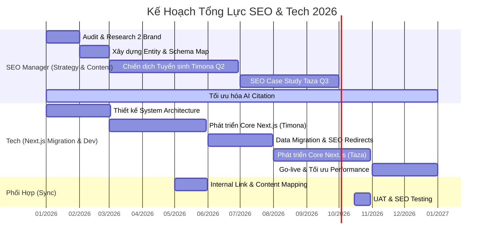

# Kế Hoạch SEO 2026 - Phiên Bản 2 (Focus: Timona & TazaSkinClinic)

## 1. Cơ Cấu Nhân Sự Chiến Lược
Dự án được vận hành bởi đội ngũ tinh gọn nhưng chuyên sâu:

*   **1 SEO Manager**:
    *   Chịu trách nhiệm toàn bộ chiến lược từ khóa, nội dung và KPI Lead cho 2 Brand.
    *   Xây dựng cấu trúc Entity, tối ưu hóa AIO (AI Overviews) và Citation Rate.
    *   Phối hợp với Tech để đảm bảo cấu trúc dữ liệu (Schema) và SEO On-page trên nền tảng mới.
*   **1 Full-stack Tech**:
    *   **Trọng tâm**: Chuyển đổi toàn bộ hệ thống từ WordPress sang **Next.js Full Stack**.
    *   Mục tiêu: Tối ưu hóa Core Web Vitals (LCP, FID, CLS), tăng tốc độ tải trang < 1s.
    *   Xử lý Technical SEO nâng cao: Server Side Rendering (SSR), Static Site Generation (SSG), và bảo trì hệ thống.

---

## 2. Chiến Lược Hai Thương Hiệu Trọng Tâm

### A. Timona Academy (Đào tạo & Tuyển sinh)
*   **Mục tiêu**: Tăng trưởng 50% lượt đăng ký khóa học thẩm mỹ chính quy.
*   **Từ khóa trọng tâm**: "học nghề spa", "phun xăm thẩm mỹ", "ITEC quốc tế", "hướng nghiệp thẩm mỹ 2026".
*   **Content Strategy**: Tập trung vào Case study học viên (Before/After học nghề), Lộ trình sự nghiệp 100% việc làm, và các video PBL (Project Based Learning).

### B. TazaSkinClinic (Dịch vụ y khoa)
*   **Mục tiêu**: Đẩy mạnh lead dịch vụ Peel da an toàn, Phục hồi sinh học và Trẻ hóa HIFU.
*   **Từ khóa trọng tâm**: "peel da trị mụn không bong", "phục hồi da PRP", "nâng cơ HIFU", "bác sĩ da liễu TPHCM".
*   **Local SEO**: Tối ưu hóa Map và Entity cho chuỗi chi nhánh tại TPHCM, Đà Nẵng, Nha Trang.

---

## 3. Lộ Trình Chuyển Đổi Công Nghệ (WP -> Next.js)
Việc chuyển sang Next.js là bước ngoặt để đột phá SEO trong kỷ nguyên AI:
*   **SSR (Server Side Rendering)**: Giúp bot Google và AI quét nội dung tức thì và chính xác nhất.
*   **Performance**: Đạt điểm 100/100 Google PageSpeed dễ dàng hơn.
*   **Customization**: Xây dựng các công cụ AI tư vấn da cá nhân hóa ngay trên web.

---

## 4. Timeline / Gantt Chart Chi Tiết 2026

---

## 5. Danh Mục Đầu Việc Chi Tiết

| Tháng | SEO Manager | Tech (Next.js Project) |
| :--- | :--- | :--- |
| **Q1** | Audit từ khóa 2025, chốt KPI 2026 cho Timona & Taza. Setup Google Search Console mới. | Khảo sát DB WordPress hiện tại, thiết kế Schema Next.js & UI/UX mới. |
| **Q2** | Tập trung content hướng nghiệp Timona (Mùa tuyển sinh). Xây dựng vệ tinh Social. | Code Frontend/Backend Next.js cho Timona. Setup Vercel/Self-host Docker. |
| **Q3** | Tập trung dịch vụ Taza. Review hiệu quả Content AI. Quản lý CTV nội dung. | Migration dữ liệu Timona -> Next.js. Bắt đầu build site Taza trên nền tảng mới. |
| **Q4** | Chiến dịch Tết cho Taza. Tổng kết dự án, báo cáo ROI & Kế hoạch 2027. | Go-live toàn diện. Triển khai AI Chatbot tư vấn da tích hợp sâu vào Next.js. |
